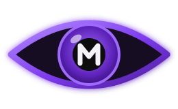

# EYEM — Eye-Blink Morse Translator

<p align="center">
  
</p>

<p align="center">
  <strong>Turn eye blinks into Morse code and text — live, in your browser.</strong><br>
  Private by design. No video ever leaves your device.
</p>

<p align="center">
  <a href="https://tk-2f.github.io/EYEM/"></a>
  
  
  
</p>

> EYEM turns eye blinks into Morse and text instantly in your browser, private and serverless. Auto-calibrates, supports 54 symbols, live two-way translation, Morse beep, voice-to-Morse, quick copy, collapsible table and C/M/F/R shortcuts with a dark purple accessible UI for inclusive assistive needs.

---

### 🌐 Live Demo

**Just open the link — no install required:**

**https://tk-2f.github.io/EYEM/**

1. Press **Start Camera** (or `C`) → allow camera permission
2. Keep eyes open 2–3s — purple vertical bar calibrates, then disappears
3. Blink to type — translation appears instantly
4. No camera? Type directly or press `M` to speak

> Requires Chrome/Edge, `https://` or `localhost`, and camera/mic permission.

---

### 📸 Preview

<p align="center">
</p>

---

### ✨ Features

- **Real-time blink → Morse → Text** — adaptive auto-calibration (~2.8s, 45 EAR samples), 5-frame smoothing, hysteresis thresholds
- **Bidirectional** — type Morse to get English, type English to get Morse instantly
- **54 symbols** — A–Z, 0–9 and punctuation ` . , ? ' ! / ( ) & : ; = + - _ " $ @`
- **Single-line translation table** — Letters / Numbers / Punctuation, each collapsible (`▼`), every cell in one line like `A .-`
- **Voice → Morse** — mic button inside Translation box + `M` shortcut (Web Speech API)
- **Morse audio** — dot 80ms / dash 240ms at 700Hz, mute toggle inside Morse box (persists via `localStorage`, respects `prefers-reduced-motion`)
- **Copy & Sound inside boxes** — Copy bottom-left, Voice/Sound bottom-right, with light click pop (900→600Hz)
- **Notifications** — toasts + Quick Start slide from the right (`top:58px`), 5s delay, auto-hide 20s, × on hover
- **Dark purple accessible UI** — `var(--muted) #a99ac0`, custom 8–10px scrollbar, eye-indicator (top-right), vertical calibration bar (`#9f67ff → #5b21b6`)
- **Keyboard shortcuts** — `C` Camera, `M` Mic, `F` delete last symbol, `R` reset (all ignored while typing)
- **100% client-side** — MediaPipe runs in-browser, no backend, no data upload

---

### 🎯 How It Works

1. **Camera on** → MediaPipe Face Landmarker (Tasks Vision 0.10.14, GPU→CPU fallback) tracks 478 landmarks locally via CDN
2. **EAR calculation** → eye-aspect-ratio smoothed over 5 frames; thresholds `0.62× / 0.78×` median with hysteresis
3. **Timing** → `<0.15s` ignored (natural blink) · `0.15–0.70s` = dot `·` · `0.70–2s` = dash `—` · `>2s` ignored
4. **Sequencing** → Double blink (700ms gap) = new letter (space) · Triple blink = new word (`/`) · Flush idle 750ms
5. **Translation** → `js/morse.js` decodes live, updates both boxes and `aria-live` region

---

### ⌨️ Blink & Typing Guide

| Action | Result |
|---|---|
| Quick blink (~0.15–0.70s) | `·` dot |
| Hold ~1s (0.70–2s) | `—` dash |
| Double blink | New letter (space) |
| Triple blink | New word (`/`) |
| `F` | Delete last symbol (`·`/`—`/` ` / ` / `) |
| `R` (camera on, outside input) | Clear all — `Cleared — blink again to start.` |
| In Morse box | Type `.` `-` · `space` = letter · `//` or double-space = word |
| In Translation box | Type English → Morse appears instantly |
| `C` / `M` | Toggle Camera / Mic (outside inputs only) |

Example: `.... . .-.. .-.. --- / ..-. .-. .. . -. -..` → `HELLO FRIEND`

---

### 🛠️ Tech

- **Frontend** — Vanilla HTML/CSS/JS, no build step, versioned cache-bust (`?v=52`)
- **Vision** — `@mediapipe/tasks-vision@0.10.14` + WASM (`face_landmarker.task` from `storage.googleapis.com`)
- **Audio** — Web Audio API (click + Morse beep), Web Speech API (`webkitSpeechRecognition` fallback)
- **Perf & A11y** — 5-frame EAR average, GPU→CPU fallback, `aria-live="polite"` Morse feed, focus trap + Esc in About modal, `prefers-reduced-motion` guard

**Run locally (camera/mic need secure context):**
```bash
# Python
python -m http.server 8000
# then open http://localhost:8000

# or Node
npx serve .
```

---

### 🔒 Privacy

Everything runs on-device. No video, audio, or keystrokes are sent to any server. MediaPipe and Speech Recognition run in your browser.

---

### 👥 Who Is EYEM For?

- People with limited mobility (ALS, spinal injuries) who can blink reliably
- Assistive-technology builders exploring camera-based input without special hardware
- Developers / students / researchers in CV, HCI, eye-tracking
- Morse learners and anyone curious to control software with eyes

---

### 🙏 Credits

Developed by **Tareq khattab**

- GitHub: [@tk-2f](https://github.com/tk-2f)

---

<p align="center">
  <sub>Built with care — accessibility first. If EYEM helped you, please ⭐ the repo.</sub>
</p>
